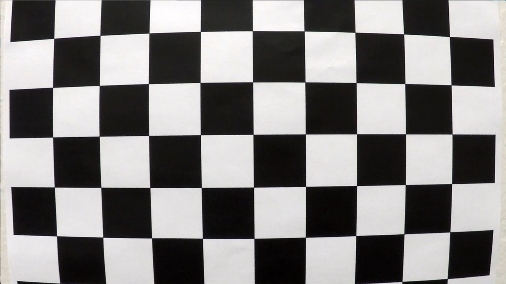
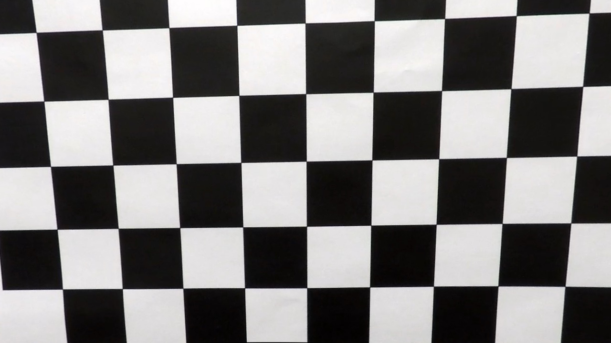

##Writeup Template
###You can use this file as a template for your writeup if you want to submit it as a markdown file, but feel free to use some other method and submit a pdf if you prefer.

---

**Advanced Lane Finding Project**

The goals / steps of this project are the following:

* Compute the camera calibration matrix and distortion coefficients given a set of chessboard images.
* Apply a distortion correction to raw images.
* Use color transforms, gradients, etc., to create a thresholded binary image.
* Apply a perspective transform to rectify binary image ("birds-eye view").
* Detect lane pixels and fit to find the lane boundary.
* Determine the curvature of the lane and vehicle position with respect to center.
* Warp the detected lane boundaries back onto the original image.
* Output visual display of the lane boundaries and numerical estimation of lane curvature and vehicle position.

[//]: # (Image References)

[distorted]: ./output_images/cal_distorted.png "distorted"
[undist0]: ./output_images/cal_undistorted_0.png "undistorted"

[calibr4]: ./camera_cal/calibration4.jpg "calibr4m"
[calibr5]: ./camera_cal/calibration5.jpg "calibr5m"

[undist1]: ./output_images/cal_undistorted_1.png "undistorted"
[undist2]: ./output_images/cal_undistorted_2.png "undistorted"
[undist3]: ./output_images/cal_undistorted_3.png "undistorted"

[imagea]: ./test_images/test1.jpg "Road Transformed"
[image3]: ./examples/binary_combo_example.jpg "Binary Example"
[image4]: ./examples/warped_straight_lines.jpg "Warp Example"
[image5]: ./examples/color_fit_lines.jpg "Fit Visual"
[image6]: ./examples/example_output.jpg "Output"
[video1]: ./project_video.mp4 "Video"


### Camera Calibration


The code for this step is contained in lines # through # of the file called `calibrate.py`).  

I start by preparing "object points", which will be the (x, y, z) coordinates of the chessboard corners in the world. I assumed (according to project instructions) that calibration pattern will be fixed, with 6 rows and 
9 columns of 'inner crosses'. Next assumptions are:
  - that calibration pattern is flat (z == 0 for all corners)
  - that calibration consists of squares with some (arbitrary) side length.
  I assigned to that length a value of 40 - just because in several projects I used calibration pattern
with 40 mm squares.
Array of 54 ( 9 x 6 ) 3d points, formed in that way, was added to the **objPoints** list for each image,
in which `cv2.findChessboardCorners` function idendified all the corners.

I then used the output `objpoints` and `imgpoints` to compute the camera calibration and distortion coefficients using the `cv2.calibrateCamera()` function.  I applied this distortion correction to the test image using the `cv2.undistort()` function and obtained this result: 

After the first run, it became obvious, that:
- corners were not found in images 1,4 and 5
- after uhdistortion, left vertical line in the undistorted image was not straight - it was curved 'outside'
(in the direction opposite to that in original image):

Original (distorted) image				




Undistorted image


 


Then I attempted to use different pattern size in cases where `cv2.findChessboardCorners` failed (file `calibration.py`, lines 51-60. For that purpose, I refactored the creation of pattern's object coordinates into
separate fucntion (lines 16-23 of the same file). It helped with the first image, but not with images 4 and 5. In ordinary situation
I would live them alone, and asked user to shot additional images, reminding her that all 6x9 inner crosses
are to be visible in every shot. But here I can't make new shots. And I need these images, because they are
'close-ups', with more prominent distortion.

As the source of the error was the irreqularity of detected patterns (different number of corners in different
rows or columns, I edited these images, wiping-out portions of them. Here are two modified images:

**Modified calibration4.jpg ( pattern 8x6) and calibration5.jpg ( pattern 9x5)**


After this modification all 20 calibration images were processed, but undistorted images remained curved.

Then I noticed, that by default `cv2.calibrateCamera()` calculates only 5 'basic' distortion coefficients -
and do not calculate coefficients for more advanced camera models. I turned corresponding flags on, one by 
one - and all models were included. Addition of 'Rational model' improved things a bit. With all tilted
model lines became straight - but additional perspective distortion was added (third image).
I think, we need more data to calculate these coefficients.
Unfortunately , in curent version of OpenCV thing prism model without tilted model does not work.
So, I decided to use rational model (8 distortion coefficients, second image).

flags = 0; 5 coefficients


flags = CALIB\_RATIONAL_MODEL; 8 coefficietns


flags = CALIB\_RATIONAL\_MODEL | CALIB\_THIN\_PRISM\_MODEL; 12 coefficietns


flags = CALIB\_RATIONAL\_MODEL | CALIB\_THIN\_PRISM\_MODEL | CALIB\_TILTED\_MODEL; 14 coefficietns



*(To use THIN\_PRISM\_MODEL, you need to update OpenCV to version 3.2)*

We can also compare original and undistorted images by superimposing them.

Here is original and 'rational model' superposition.


You can see that all differenes are near image borders, at the center both images 
coinside. And this is a normal situation for almost any lens. I have only one lens
in my collection, which may give signigicant distortions at the center of
the frame - at that one is the 'artistic' LensBaby 2.0.


### Pipeline (single images)

Examples above show that lens distortion is minimal at the center of the images,
where we expect lines to appear. So, I'll not publish 'undistorted lanes' here - 
you'll see effect of undistortion few linew below.


#### 2. Colors, gradients, thresholds.


For thresholding, I used a cobination of:
- color threshold in S-channels of the HLS color space
- sobel magntiude threshold
- sobelX treshold

The code for thresholding (adoprted from the lesson with
minor modifications) you can find in the file `stack.py` 

In this image you see 'test2' image with overlayed binary images: 
- blue for S-channel threshold
- green for sobel magnitude
- red for sobelX


Here you can clearly see, pronounced undistortion effect on the sign - but
not on the lanes.

In my 'real life' (outside of carND), I've spent a lot of time analysing different
line-extraction approaches, and I can definitely say, and I can definitely say, that this
one is not the best. But it works :)


#### 3. Perspective transform.

To calculate perspective transform, I used provided file `straight_lines1.jpg'.
The image was undistorted using intrinsic camera parameters calculated in the
fiers step. Then I found line coordinates with the help of detectLanes() function
developed in [P1](https://github.com/diz-vara/CarND-P1/blob/master/P1.ipynb).


Two original lines coordinates were calculated by `detectLanes()`:
```
src = np.float32(
   [[ lines[0][0], lines[0][1]],
    [ lines[0][2], lines[0][3]], 
    [ lines[1][0], lines[1][1]],
    [ lines[1][2], lines[1][3]], 
```
which approximately gives:

```
src = np.float32(
   [[ 268, 676],
    [ 580, 460], 
    [1046, 676], 
    [697,  460]])
``` 
 To calculate transformation that will make these lines vertical 
 (and full-height), destination points have same x-coordinates,
 and y-coodrdinates corresponding to the size of the image: 
```
dst = np.float32(
   [[ lines[0][0], height],
    [ lines[0][0], 0], 
    [ lines[1][0], height], 
    [ lines[1][0],  0]])
 ```
where height = image.shape[0]

Result of coordinate transformation is shown below: 
 


#### 4. Lane-line pixels and polynomial fit

At this point, it became possible to apply thresholding, undistortion and perspective
transformation - and obtain bird-eye view of the curved lines:

I also removed noise (small particles) by simple 'open' operation
(`cv2.MORPH_OPEN`)


#### 5. Describe how (and identify where in your code) you calculated the radius of curvature of the lane and the position of the vehicle with respect to center.

I did this in lines # through # in my code in `my_other_file.py`

#### 6. Provide an example image of your result plotted back down onto the road such that the lane area is identified clearly.

I implemented this step in lines # through # in my code in `yet_another_file.py` in the function `map_lane()`.  Here is an example of my result on a test image:

![alt text][image6]

---

###Pipeline (video)

####1. Provide a link to your final video output.  Your pipeline should perform reasonably well on the entire project video (wobbly lines are ok but no catastrophic failures that would cause the car to drive off the road!).

Here's a [link to my video result](./project_video.mp4)

---

###Discussion

####1. Briefly discuss any problems / issues you faced in your implementation of this project.  Where will your pipeline likely fail?  What could you do to make it more robust?

Here I'll talk about the approach I took, what techniques I used, what worked and why, where the pipeline might fail and how I might improve it if I were going to pursue this project further.  

